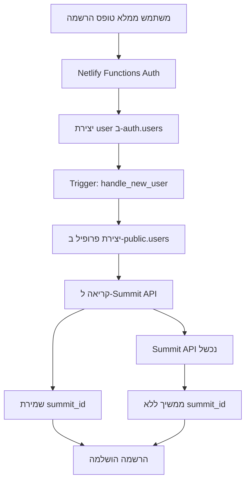

# Spectra CI - Phase 1: User Management with Neon Database

## 📋 Phase Summary

Phase 1 implements a complete user management system with JWT authentication, registration, login, and automatic synchronization with Summit API. The system uses Neon PostgreSQL database with Netlify Functions backend and includes role management (admin/user/partner).

---

## 🎯 Phase Objectives

- ✅ Simple registration with full details (name, phone, email, password)
- ✅ JWT-based authentication with Netlify Functions
- ✅ Neon PostgreSQL database integration
- ✅ Automatic synchronization with Summit API (customer creation)
- ✅ Role management: admin, user, partner
- ✅ Secure password hashing and session management
- ✅ Modern, mobile-first user interface

---

## 🏗️ Technical Architecture

### Frontend (React + TypeScript)

```
src/
├── screens/Auth/
│   ├── LoginPage.tsx          # Login page
│   ├── SignUpPage.tsx         # Sign up page
│   └── index.ts               # Component exports
├── api/
│   ├── client.ts            # User management API
│   └── client.ts     # Netlify Functions API client
├── context/
│   └── UserContext.tsx       # User state management context
├── hooks/
│   └── useUser.ts           # User management hook
└── components/
    └── Navigation.tsx        # Navigation with authentication
```

### Backend (Neon + Netlify Functions)

```sql
-- Users table
public.users (
  id uuid PRIMARY KEY,          -- Auth ID
  email text UNIQUE,            -- Email
  full_name text,               -- Full name
  phone text,                   -- Phone
  role text DEFAULT 'user',     -- Role
  summit_id text,               -- Summit ID
  created_at timestamp,         -- Creation date
  updated_at timestamp          -- Update date
)
```

### Summit Integration

- Automatic customer creation during registration
- Storing summit_id for future use
- Fallback if Summit API is unavailable

---

## 🛠️ התקנה והגדרה

### 1. הגדרת בסיס הנתונים

הרץ את הסקריפט `neon-schema.sql` ב-Neon console:

```bash
# העתק את התוכן מהקובץ neon-schema.sql
# הדבק ב-Neon Console
# הרץ את הסקריפט
```

### 2. משתני סביבה

ודא שהמשתנים הבאים מוגדרים ב-`.env`:

```env
# Neon Database
NEON_DATABASE_URL=your_neon_connection_string
JWT_SECRET=your_anon_key

# Summit API
VITE_SUMIT_API_URL=https://api.sumit.co.il
VITE_SUMIT_API_KEY=your_summit_api_key
VITE_SUMIT_ORGANIZATION_ID=your_org_id
```

### 3. הפעלת המערכת

```bash
npm install
npm run dev
```

---

## 🔐 מערכת הרשאות (RLS)

### Policies שנוצרו:

1. **"Users can read own profile"** - משתמש יכול לקרוא את הפרופיל שלו
2. **"Users can update own profile"** - משתמש יכול לעדכן את הפרופיל שלו
3. **"Admins can read all users"** - אדמין יכול לקרוא את כל המשתמשים
4. **"Admins can update all users"** - אדמין יכול לעדכן את כל המשתמשים
5. **"Enable insert for authenticated users"** - הוספת משתמש חדש

### Triggers:

- **handle_new_user()** - יוצר פרופיל אוטומטית בעת הרשמה
- **update_updated_at_column()** - מעדכן את updated_at אוטומטית

---

## 📱 ממשק המשתמש

### עמודי אימות:

- `/login` - התחברות עם מייל וסיסמה
- `/signup` - הרשמה עם פרטים מלאים

### ניווט דינמי:

- משתמש לא מחובר: כפתורי "התחברות" ו"הרשמה"
- משתמש מחובר: שם המשתמש וכפתור "יציאה"
- אדמין: כפתור נוסף "דשבורד"

### עיצוב:

- מובייל-first responsive design
- Glass effect ו-backdrop blur
- Gradient backgrounds בסגנון Spectra
- טיפוסגרפיה עברית מותאמת

---

## 🔄 זרימת הרשמה (Flow)



---

## 🧪 בדיקות

### בדיקות פונקציונליות:

#### הרשמה:

- [ ] הרשמה עם כל השדות מצליחה
- [ ] הרשמה ללא שדות חובה נכשלת
- [ ] סיסמה קצרה מ-6 תווים נכשלת
- [ ] מייל כפול נכשל
- [ ] summit_id נשמר אחרי הרשמה מוצלחת
- [ ] maor@spectra-ci.com מקבל role='admin'

#### התחברות:

- [ ] התחברות עם פרטים נכונים מצליחה
- [ ] התחברות עם פרטים שגויים נכשלת
- [ ] role מזוהה נכון אחרי התחברות

#### ניווט:

- [ ] משתמש לא מחובר רואה כפתורי התחברות/הרשמה
- [ ] משתמש מחובר רואה שם + כפתור יציאה
- [ ] אדמין רואה כפתור דשבורד נוסף

### בדיקות טכניות:

#### Database:

- [ ] טבלת users נוצרה עם Schema נכון
- [ ] RLS Policies פועלות
- [ ] Triggers פועלים
- [ ] Indexes נוצרו

#### Summit Integration:

- [ ] קריאה ל-Summit API פועלת
- [ ] summit_id נשמר בהצלחה
- [ ] Fallback עובד כשהAPI נכשל

---

## 🐛 פתרון בעיות נפוצות

### 1. טבלת users לא נוצרה

```sql
-- הרץ ב-Neon console:
DROP TABLE IF EXISTS public.users CASCADE;
-- ואז הרץ שוב את neon-schema.sql
```

### 2. RLS חוסם גישה

```sql
-- בדוק policies:
SELECT * FROM pg_policies WHERE tablename = 'users';
```

### 3. Summit API לא עובד

- בדוק משתני סביבה
- בדוק שהAPI Key תקף
- בדוק logs בקונסול הדפדפן

### 4. Trigger לא פועל

```sql
-- בדוק שהטריגר קיים:
SELECT * FROM information_schema.triggers
WHERE event_object_table = 'users';
```

---

## 📊 מטריקות הצלחה

### KPIs לשלב 1:

- ✅ זמן הרשמה: < 30 שניות
- ✅ זמן התחברות: < 5 שניות
- ✅ שיעור הצלחת סנכרון Summit: > 95%
- ✅ זמן טעינת עמודי Auth: < 2 שניות
- ✅ תאימות מובייל: 100%

### Analytics לעקוב:

- מספר הרשמות יומי
- שיעור התחברות מוצלחת
- שיעור שגיאות Summit API
- זמני טעינה ממוצעים

---

## 🚀 השלבים הבאים

### שלב 2: הרשאות מתקדמות

- RLS Policies מורכבות יותר
- ניהול תפקידים דינמי
- Audit log לפעילות אדמין

### שלב 3: טפסי לידים

- טבלת leads
- אינטגרציה עם טפסים באתר
- דוחות לידים בדשבורד

### שלב 4: מעקב CTA

- טבלת cta_clicks
- Analytics בזמן אמת
- A/B testing framework

---

## 📞 תמיכה

### יצירת קשר:

- **מייל**: maor@spectra-ci.com
- **WhatsApp**: +972-50-432-2680
- **GitHub Issues**: [Repository Link]

### תיעוד נוסף:

- [Neon Documentation](https://neon.tech/docs)
- [Summit API Documentation](https://docs.sumit.co.il)
- [React Router Documentation](https://reactrouter.com)

---

**📅 Creation Date**: January 2025  
**🔄 Version**: 1.0  
**👨‍💻 Developer**: Claude Sonnet 4 + Maor Ganon  
**✅ Status**: Ready for Production
