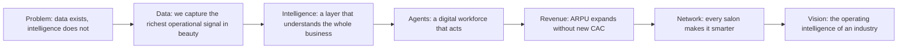

# Investor Narrative — Spectra Product & Vision

> The business story. Not the page.
> This document defines what an investor must *believe* by the end of the experience.
> Every answer below maps to a specific section of the page.

---

## The One-Line Thesis

**Salon AI is building the intelligence infrastructure for the global beauty industry — starting from the one place where the data is richest and least understood: the chair.**

We do not sell software. We sell intelligence that compounds.

---

## The Strategic Frame

The page is engineered to walk an investor through a single, inevitable conclusion:

The investor should never feel they are looking at "another salon SaaS." They should feel they are early to a **category**.

---

## The Ten Questions

### 1. Why now?

Three forces converged in the last 24 months:

- **AI crossed the usefulness threshold.** Reasoning models can now read messy operational data and produce decisions, not just dashboards.
- **Beauty went digital but stayed dumb.** Salons adopted booking, POS, and CRM tools, but those tools record activity and never interpret it.
- **Margins are under pressure.** Labor, rent, and product costs rose. Owners need intelligence, not more screens.

The window: the tools exist, the pain is acute, and no incumbent has unified the stack into an intelligence layer. First mover on data wins.

> **Maps to:** Section 1 (Opening) + Section 2 (Problem).

### 2. Why AI?

Because the beauty business is an unstructured-data business pretending to be a scheduling business.

Every appointment, formula, reorder, and follow-up is a decision. Today those decisions are made on intuition. AI turns the salon's own history into the answer to "what should I do next?" — for the owner, the stylist, and the customer.

Dashboards ask people to interpret. AI removes the interpretation step entirely.

> **Maps to:** Section 5 (The Brain) + Section 6 (AI Workforce).

### 3. Why beauty?

Beauty is a massive, fragmented, high-frequency, high-margin, relationship-driven industry — the ideal substrate for a data flywheel.

- **Massive:** millions of salons globally, hundreds of billions in annual service revenue.
- **Fragmented:** no dominant operating system; mostly point tools and spreadsheets.
- **High-frequency:** recurring visits create dense, repeating data per customer.
- **Relationship-driven:** retention and personalization directly drive revenue, which is exactly what intelligence improves.

Beauty is underserved by serious technology and overflowing with usable signal. That asymmetry is the opportunity.

> **Maps to:** Section 3 (Ecosystem) + Section 8 (Data Network).

### 4. Why Spectra?

Spectra is the wedge — and the unfair data advantage.

Color service is the highest-margin, highest-waste, least-measured event in the salon. Spectra instruments it: every formula, every gram weighed, every reweigh, every gram consumed, every cost, every outcome.

No CRM or booking tool has this. It is **proprietary, structured, ground-truth data about what actually happens during the service** — the part of the business that was previously invisible. That is the data no competitor can buy.

Spectra also lands with hard ROI on day one (waste reduction, margin recovery), which makes adoption easy and trust immediate.

> **Maps to:** Section 4 (Customer Journey) — formula and consumption data points.

### 5. Why Salon OS?

Salon OS is how we own the commercial surface area of the business.

CRM, booking, POS, memberships, inventory, purchasing, reporting, marketing, team. It is sellable as standalone SaaS with a low-friction entry point, and it captures the second half of the data picture: the commercial side.

Spectra sees the service. Salon OS sees the business. Together they see everything — which is the precondition for intelligence that actually works.

> **Maps to:** Section 3 (Ecosystem) — Owner, Reception, Payments, Inventory nodes.

### 6. Why agents?

Reports tell you what happened. Agents do something about it.

The AI Workforce is the leap from "insight" to "action": a Customer Success agent that rebooks at-risk clients, a Marketing agent that runs campaigns, an Inventory agent that reorders before stockout, an Operations agent that fixes the schedule, a BI agent that watches profitability, and a Spectra agent that optimizes formulas.

Agents are also the mechanism for the most defensible revenue: customers don't pay for a feature, they pay for **continuous work performed**. That reframes the product from a tool into labor.

> **Maps to:** Section 6 (AI Workforce).

### 7. Why marketplace?

Once Salon AI is the operating center of the salon, transactions flow through it: payments, embedded finance, product commerce, supplier replenishment, education, benchmarking.

This is revenue beyond subscription — high-margin, usage-driven, and only available to whoever owns the operating layer. The marketplace is not the entry strategy; it is the inevitability once we are the system of record and the system of action.

> **Maps to:** Section 7 (Customer Evolution) — later layers + Section 9 (Vision).

### 8. Why data moat?

Every salon, every service, and every formula makes the platform smarter — and the value accrues to the network, not to any single customer.

We accumulate the industry's most valuable assets:

- Global color intelligence
- Hair-journey intelligence
- Product-performance intelligence
- Service-economics intelligence
- Industry benchmarking

A new entrant can copy features. They cannot copy years of proprietary, structured, cross-salon outcome data. The moat widens automatically with adoption.

> **Maps to:** Section 8 (Data Network).

### 9. Why can ARPU expand 10x?

Because the customer never switches systems — they unlock layers.

| Stage | Products | Monthly |
| --- | --- | --- |
| Year 1 — Foundation | Salon OS + Spectra | ~$250 |
| Year 2 — Intelligence | + AI credits | ~$450 |
| Year 3 — Automation | + first agents | ~$800 |
| Year 4 — Digital Workforce | full agent team | ~$1,200–1,500 |
| Year 5+ — Enterprise | multi-location + benchmarking | ~$3,000–10,000+ |

Expansion happens with **zero additional acquisition cost**. Trust earned at the foundation layer converts directly into consumption and automation revenue. This is the engine investors recognize: **Land → Expand → Automate → Network Effects**, with net revenue retention well above 100%.

> **Maps to:** Section 7 (Customer Evolution).

### 10. Why can this become a billion-dollar company?

Multiply three things:

- A **large fragmented market** (millions of locations).
- A **high and expanding ARPU** (from ~$250 to multiple thousands per location).
- A **data moat** that increases retention and pricing power over time.

A small share of global salons at expanded ARPU, retained by a deepening moat and supplemented by marketplace take-rate, produces a category-defining outcome. The ceiling is not "salon software revenue" — it is "the intelligence layer of an entire industry."

> **Maps to:** Section 9 (Vision).

---

## What The Investor Should Feel, In Order

1. **Recognition** — "Yes, that data really is wasted." (Problem)
2. **Tension** — "Someone should be turning that into intelligence." (Data)
3. **Relief** — "They are, and it understands the whole business." (Intelligence)
4. **Acceleration** — "And it doesn't just advise, it acts." (Agents)
5. **Greed (the good kind)** — "And the customer pays more every year without leaving." (Revenue)
6. **Inevitability** — "And it gets stronger as it grows." (Network)
7. **Scale** — "This isn't a product. It's infrastructure." (Vision)

If the page produces those seven feelings in that order, it has done its job.

---

## Narrative Guardrails

- Lead with the problem and the data, never with the product list.
- Spectra is the *proof of unfair data*, not the headline.
- Always tie a visual to a business consequence (data → decision → revenue).
- Numbers shown must trace back to the forecast model; never invent figures on the page.
- The closing line is the whole thesis: *runs the business, runs the service, understands everything.*
