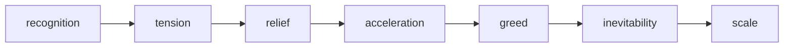
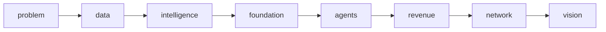

# Storyboard — Spectra Product & Vision

> The cinematic script for the scroll. Section by section: the beat, the visual,
> the emotion, the copy hand-off, and the transition into the next moment.
> Think of this as the keynote running order, not a webpage outline.

---

## Director's Intent

The investor is not reading a page. They are being walked through a reveal.

Pacing is deliberate: long pauses on big statements, fast bursts when the system comes alive. The black never fully leaves; gold is rationed so it always feels like light, not decoration.

**Emotional arc (must land in order):**

**Story order (never products-first):**

---

## Section 1 — The Opening

- **Beat:** Curtain up. A category, not a company.
- **Visual:** Pure black. A faint constellation of gold nodes drifts (`network-field-bg`). "Salon AI" resolves at center.
- **Sequence:**
  1. Black hold (0.5s).
  2. Eyebrow fades up: *The AI-Native Operating System for Beauty.*
  3. `Salon AI` scales in, settles.
  4. Three lines breathe in, one at a time: *Salon OS runs the business. / Spectra runs the service. / Salon AI understands everything.*
  5. `Begin` cue pulses at base.
- **Emotion:** Anticipation. Premium calm.
- **Transition out:** As the user scrolls, the drifting nodes begin to **connect** — filaments draw between them, carrying momentum into the Problem.
- **Assets:** `network-field-bg`, `network-field-poster`, `salon-ai-wordmark`.

---

## Section 2 — The Problem

- **Beat:** Name the truth the investor already half-knows.
- **Visual:** Six frosted system chips (`system-chip-*`) float **apart** in the void — Booking, CRM, Inventory, POS, Marketing, Color. Cold. Disconnected.
- **Sequence (scrubbed by scroll):**
  1. Chips scattered, drifting independently. Eyebrow: *The Problem.*
  2. As scroll advances, chips drift **inward**, almost touching — but never connect. Line: *Six systems. One business. No intelligence.*
  3. Chips dim. Headline takes the screen: *Software records activity. / It does not understand it.*
  4. Final line lands alone: *Every day, salons generate enormous data.* → *Nobody turns it into intelligence.*
- **Emotion:** Recognition → tension. The investor leans in.
- **Transition out:** The dimmed chips collapse toward a single point — which becomes the first role node of the salon.
- **Assets:** `system-chip-booking/crm/inventory/pos/marketing/color`.

---

## Section 3 — The Salon Ecosystem

- **Beat:** Show the living business where all that data is born.
- **Visual:** Seven role nodes arranged radially (`role-icon-*`) around an empty center. Gold lines (`ecosystem-connection-layer`) draw between them as activity flows.
- **Sequence:**
  1. Headline: *A business in motion.* Sub: *Every role. Every moment. Every signal.*
  2. Connection lines draw one by one; a data spark travels each line as the activity ticker advances: *A customer books → Reception schedules → A stylist delivers → Spectra captures the formula → Inventory updates → Payment clears.*
  3. Center stays conspicuously empty (reserved — the Brain will fill it later).
  4. Closing: *Everything here is data.*
- **Emotion:** Order returning. The fragments from S2 are now one organism.
- **Transition out:** Camera pushes toward a single node — the Customer — to follow one of them.
- **Assets:** `ecosystem-connection-layer`, 7 `role-icon-*`, optional `ecosystem-environment-bg`, plus product cameos (`salon-os-dashboard-mockup`, `spectra-tablet-mockup`) revealed subtly when Reception/Color Bar light up.

---

## Section 4 — The Customer Journey

- **Beat:** Make data emotional by following one human visit end to end.
- **Visual:** A horizontal path with 9 stops. The customer marker (`journey-avatar`) travels it, scrubbed by scroll. Each stop emits a glowing `journey-data-point`.
- **Sequence:**
  1. Headline: *Follow a single visit.*
  2. Avatar advances: Booking · Arrival · Consultation · Color service · Formula created · Product consumed · Payment · Follow-up · Rebooking.
  3. At each stop, a gold mote pops (*+ data*) and begins drifting toward a collector at center-bottom.
  4. As the journey completes, **all motes stream into the core**.
  5. Climax headline ignites: *Every interaction becomes intelligence.*
- **Emotion:** Relief beginning. "Oh — the data has somewhere to go now."
- **Transition out:** The collected motes brighten the core; we pull back to reveal it in full.
- **Assets:** `journey-avatar`, `journey-data-point`, `journey-collector-core` / `ai-brain-core.png`.

---

## Section 5 — The Brain (Centerpiece)

- **Beat:** The reveal. The intelligence layer that understands the whole business.
- **Visual:** `ai-brain-core` floats dead center, pulsing, fed by data streams (`data-stream-overlay`). Nine labels orbit it: Customers, Appointments, Services, Inventory, Marketing, Communications, Payments, Formulas, Team.
- **Sequence:**
  1. Core ignites from the journey motes; bloom expands.
  2. Orbit labels appear and connect inward; streams pulse continuously.
  3. Headline: *One layer that understands the whole business.* Statement: *The first intelligence layer built for beauty.*
  4. Three audience cards stagger in: *Decisions, not dashboards (Owners) · Less admin, more craft (Employees) · A salon that remembers you (Customers).*
- **Emotion:** Awe. This is the "Apple Intelligence orb" moment.
- **Transition out:** The core spawns smaller satellites — each becomes an agent.
- **Assets:** `ai-brain-core` (+ loop/alpha/glb), `data-stream-overlay`.

---

## Section 6 — The AI Workforce

- **Beat:** Intelligence becomes action. A digital workforce.
- **Visual:** A calm command center (`command-center-bg`) with six agent cards (`agent-*`), each executing a live task.
- **Sequence:**
  1. Headline: *A workforce that never sleeps.* Sub: *Specialized agents, working alongside your team.*
  2. Cards light up one by one; each task line streams in, status flips *working → done*:
     - Customer Success — *Rebooked 3 at-risk clients.*
     - Marketing — *Launched a winback campaign.*
     - Inventory — *Reordered lightener before stockout.*
     - Operations — *Rebalanced tomorrow's schedule.*
     - Business Intelligence — *Flagged a margin drop in color.*
     - Spectra Intelligence — *Optimized 12 formulas, cut waste.*
  3. Closing: *Human teams. Digital colleagues.*
- **Emotion:** Acceleration. "It doesn't just know — it does."
- **Transition out:** The agents' activity resolves into a single rising line — revenue.
- **Assets:** 6 `agent-*`, optional `command-center-bg`.

---

## Section 7 — Customer Evolution

- **Beat:** The money beat. ARPU expands without new acquisition cost.
- **Visual:** A rising gold curve (`evolution-curve`) with five milestones; value climbs left→right, scrubbed by scroll.
- **Sequence:**
  1. Headline: *The customer never changes systems.* Sub: *They simply unlock more intelligence.*
  2. Curve draws; each milestone **unlocks** (locked→glowing) as the line reaches it:
     - Y1 Foundation — Salon OS + Spectra — **$250/mo**
     - Y2 Intelligence — + AI credits — **$450/mo**
     - Y3 Automation — + first agents — **$800/mo**
     - Y4 Digital Workforce — full team — **$1,500/mo**
     - Y5+ Enterprise — multi-location + benchmarking — **$3,000–10,000+/mo**
  3. Engine line stamps in: *Land. Expand. Automate. Compound.* Footnote: *Expansion with no new acquisition cost.*
- **Emotion:** Greed (the good kind). The investor does the multiplication in their head.
- **Transition out:** The single rising curve multiplies into many — many salons.
- **Assets:** `evolution-curve`, optional node states.

---

## Section 8 — The Data Network

- **Beat:** It compounds. Every salon makes it smarter.
- **Visual:** A point field (`network-growth-field`) densifies from 1 to 50,000 as a big counter climbs. Five intelligence bars rise in proportion.
- **Sequence:**
  1. Headline: *Every salon makes the platform smarter.*
  2. Counter scrubs: 1 → 10 → 100 → 1,000 → 10,000 → 50,000 salons; field densifies.
  3. Bars rise: Color · Customer · Service · Business · Product intelligence.
  4. Statement: *Every formula. Every service. Every salon.* → emphasis: *Data becomes the moat.*
- **Emotion:** Inevitability. The flywheel is visible.
- **Transition out:** The dense network resolves into a calm golden horizon — the vision.
- **Assets:** `network-growth-field` (+ staged frames/loop), optional `intelligence-bar-set`.

---

## Section 9 — The Vision

- **Beat:** The closer. Infrastructure, not software.
- **Visual:** `vision-cosmos-bg` — a serene golden cosmos. Three headline lines reveal in sequence.
- **Sequence:**
  1. *Salon OS runs the business.*
  2. *Spectra runs the service.*
  3. *Salon AI understands everything.*
  4. Pause. *We are not building salon software.*
  5. Final: *We are building the intelligence infrastructure for the global beauty industry.*
  6. `salon-ai-wordmark` settles; quiet CTAs: *Request access · View the model.*
- **Emotion:** Scale + resolution. The thesis lands as a feeling.
- **Transition out:** Slow fade to the confidential footer strip.
- **Assets:** `vision-cosmos-bg` (+ loop), `salon-ai-wordmark`.

---

## Cross-Section Continuity Rules

- **The center point is sacred.** It is empty in S3, fills in S4, becomes the core in S5, fragments into agents in S6. Maintain spatial continuity across these transitions.
- **Gold = intelligence/light.** Never use gold for decoration in a section where nothing intelligent is happening yet (S2 stays cold on purpose).
- **One idea per viewport.** Never show two headlines at once.
- **Numbers only from the model.** S7 and S8 figures must match the forecast source; no invented precision.
- **Every visual earns a business line.** If a moment doesn't advance Problem→…→Vision, cut it.

---

## Pacing Map (relative dwell)

| Section | Relative length | Energy |
| --- | --- | --- |
| 1 Opening | medium | calm, building |
| 2 Problem | medium | tense, cold |
| 3 Ecosystem | long | warming, alive |
| 4 Journey | long | intimate, building |
| 5 Brain | longest | awe (the peak visual) |
| 6 Workforce | medium-long | fast, active |
| 7 Evolution | long | confident, rising |
| 8 Network | medium-long | momentum |
| 9 Vision | medium | resolved, vast |
