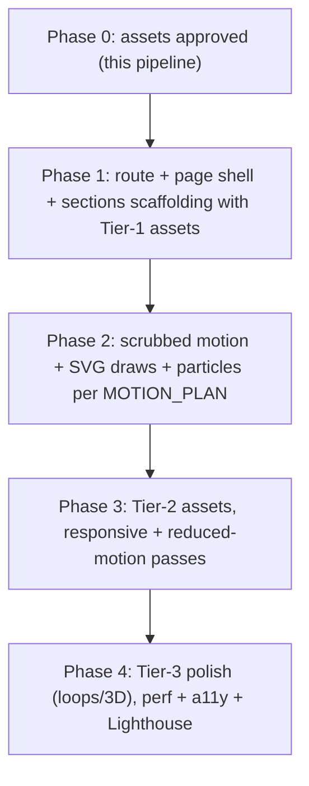

# Technical Plan — Spectra Product & Vision

> Implementation blueprint. Phase 1 (technical foundation) is implemented — see
> "Phase 1 — Implemented" below. Phases 2–4 remain and depend on real assets.

---

## Phase 1 — Implemented (foundation)

Status: **done**. The page exists, opens cleanly, and is ready to receive real
assets. No fake assets, no broken images, no navigation exposure.

**Route**
- Added hidden, code-split route `"/spectra-product-vision"` in
  [`src/index.tsx`](../src/index.tsx) using `lazy` + `Suspense` (fallback =
  `LoadingSpinner` on a black stage). No `Navigation` link added.

**New module:** `src/screens/SpectraProductVision/`
- `index.ts` — barrel export of `SpectraProductVisionPage`.
- `SpectraProductVisionPage.tsx` — page shell: forces its own dark world
  (independent of `SiteTheme`), renders the progress rail, all 9 sections in
  story order, and a confidential footer. Sets/restores `document.title`.
- `copy.ts` — typed copy constants mirroring `COPY_SYSTEM.md`.
- `tokens.ts` — palette (black + warm white + gold), fluid type scale, layout.
- `motion.ts` — shared easings/variants; simple reveal + stagger; reduced-motion
  fade-only variants. (No scrubbing yet.)
- `assetManifest.ts` — typed manifest of every asset declared in `README.md`,
  with `assetUrl()` resolving to `/investor-vision/<section>/<file>`. Declares
  only specified assets; invents nothing.
- `primitives/` — `Section`, `Eyebrow`, `Headline` (line-by-line reveal),
  `AssetSlot` (graceful missing-asset handling), `ProgressRail`, plus `index.ts`.
- `sections/` — `OpeningSection`, `ProblemSection`, `SalonEcosystemSection`,
  `CustomerJourneySection`, `IntelligenceCoreSection`, `AIWorkforceSection`,
  `CustomerEvolutionSection`, `DataNetworkSection`, `VisionSection`, plus
  `index.ts`.

**Missing-asset handling (`AssetSlot`)**
- Tries to load the manifest file. On error (Phase 1: all assets are absent):
  - **Development** → clean premium empty-state frame naming the expected asset
    + path + priority, so designers know exactly what to drop in.
  - **Production** → renders nothing (the section's copy/layout stands alone).
- Reserves space via `aspect-ratio` to avoid layout shift; images `loading="lazy"`
  + `decoding="async"`; videos muted/inline/`preload="none"` with poster.

**Layout & motion foundation**
- Desktop-first, large 100dvh stages, generous spacing, pure-black background,
  warm-white type, subtle gold accents.
- Framer Motion structure only: in-view opacity/translate reveals + staggered
  children. `useReducedMotion()` switches to fade-only and hides the rail.

**Performance foundation**
- Page is `lazy()`-loaded (code-split from the main bundle).
- Image/video loading strategy in place via `AssetSlot`.
- `prefers-reduced-motion` respected.

**Verification**
- `tsc --noEmit`: no errors in the new module (pre-existing repo errors elsewhere
  are unrelated and untouched).
- No lint errors in new files / `src/index.tsx`.
- Dev server compiles via HMR; `GET /spectra-product-vision` returns `200`.

---

## Phase 2+ — Remaining

- **Phase 2 (cinematic motion):** pinned/sticky tracks + scroll scrubbing per
  `MOTION_PLAN.md` (chip convergence, ecosystem line-draw + sparks, journey
  avatar travel + data points, brain ignite + streams, agent live tasks,
  evolution curve draw + value count-up, network densify + counter). Wire real
  numbers from `useFinancialForecastSnapshot` / `StrategicForecast`.
- **Phase 3 (assets + responsive):** drop Tier-1/2 assets into
  `public/investor-vision/<section>/`; full tablet/mobile + reduced-motion passes
  per `WIREFRAMES.md`.
- **Phase 4 (polish):** optional loops/3D core, OG meta, Lighthouse 90+, a11y.

> Original blueprint follows below (unchanged).

---

---

## Framework Decision (important)

The original brief mentioned **Next.js**. This repository is **React + Vite + TypeScript** (see `package.json` — `vite`, `@vitejs/plugin-react`, `react-router-dom@6`).

**Decision:** Build inside the existing React/Vite app. Do **not** migrate to Next.js — it would be a large, risky change for zero benefit here (this is a client-rendered, asset-driven experience, not an SEO/SSR-critical surface, and it is intentionally hidden). All "Next.js" requirements translate cleanly to the current stack:

| Brief said | We use |
| --- | --- |
| Next.js | Vite + React Router route |
| Framer Motion | Framer Motion (`framer-motion@12`, already installed) |
| Tailwind | Tailwind (`tailwindcss@3`, already configured) |
| TypeScript | TypeScript (already) |
| SVG animations | inline SVG + Framer `pathLength` |
| Parallax / sticky | `useScroll`/`useTransform` + sticky tracks |

If true SSR is ever required, the page is self-contained enough to port later.

---

## Route & Discoverability

- **Path:** `/spectra-product-vision` (hidden — no nav link, like `/spectra-story`).
- **Page title:** `Salon AI — Product & Vision`.
- **Register** in `src/index.tsx` `<Routes>` (eager or lazy — see Code-Splitting).
- **Gating:** default **public-but-unlinked** (shareable URL for investors). If gating is desired, wrap with the existing `InternalRouteGate` (as `/financial-forecast` and `/strategic-forecast` do, accessCode `"1221"`, a `sessionKey`, title/description). Confirm with stakeholder before adding the gate.
- No entry added to `Navigation`; discoverable only by direct link.

```tsx
// src/index.tsx (illustrative)
<Route path="/spectra-product-vision" element={<SpectraProductVisionPage />} />
```

---

## File / Component Structure

New screen folder, mirroring existing conventions (`src/screens/<Name>/`):

```text
src/screens/SpectraProductVision/
├── index.ts                       # export { SpectraProductVisionPage }
├── SpectraProductVisionPage.tsx   # page shell: scroll container, progress rail, sections
├── copy.ts                        # typed copy constants from COPY_SYSTEM.md
├── motion.ts                      # shared easings, variants, spring configs
├── useSectionProgress.ts          # hook: pinned-track scroll progress + spring
├── primitives/
│   ├── Section.tsx                # full-height / sticky-track wrapper
│   ├── Eyebrow.tsx
│   ├── Headline.tsx               # line-by-line reveal
│   ├── DataParticles.tsx          # pooled particle layer (canvas or motion)
│   └── ProgressRail.tsx
└── sections/
    ├── S1Opening.tsx
    ├── S2Problem.tsx
    ├── S3Ecosystem.tsx
    ├── S4Journey.tsx
    ├── S5Brain.tsx
    ├── S6Workforce.tsx
    ├── S7Evolution.tsx
    ├── S8Network.tsx
    └── S9Vision.tsx
```

Conventions to match existing code: functional components, `React.FC`, Tailwind classes, theme tokens where useful, `framer-motion` for animation, no new global state.

---

## Shipped Assets Location

- Planning docs stay in `investor-assets/` (not shipped).
- Production assets are copied to `public/investor-vision/<section>/...`, mirroring `investor-assets/assets/`.
- Reference via absolute public paths, e.g. `/investor-vision/intelligence-core/ai-brain-core.webp`.
- Keep `investor-assets/assets/` as the delivery inbox / source of truth; a small copy step (manual or script) syncs approved assets into `public/investor-vision/`.

---

## Data & Numbers

- Section 7 (Evolution) and Section 8 (Network) figures must come from the existing forecast source, not be hardcoded ad-hoc.
- Reuse `useFinancialForecastSnapshot` and/or `StrategicForecast` model exports (as `NewInvestorsDeck.tsx` does) where live numbers should appear.
- Static narrative tiers ($250 → $10k+) may live in `copy.ts` but must reconcile with the model; never invent precision on screen.

---

## Styling

- Tailwind utility classes + a few inline styles for gradient/glow tokens.
- Palette tokens (reuse brand): black `#000000`, warm white `#F5F1EA`/`#FFFFFF`, gold `#EAB776 #E0A263 #CF915B #B18059 #D4A06A`.
- Page forces a dark cinematic context regardless of global light/dark theme (it is its own world). Set local background black; do not depend on `SiteTheme`.
- Respect existing typography scale approach (clamp-based fluid type, as in `NewInvestorsDeck` tokens).

---

## Motion Implementation (see MOTION_PLAN.md)

- `framer-motion`: `useScroll`, `useTransform`, `useSpring`, `useInView`, `useReducedMotion`.
- Pinned sections: tall outer wrapper + sticky inner stage; progress via `useScroll({ target, offset: ["start start", "end end"] })`, smoothed with `useSpring`.
- Animate `transform`/`opacity` only; `will-change` toggled on active elements.
- SVG draw via `pathLength`. Particles pooled and capped (≤600), paused off-screen.
- Full reduced-motion branch renders static end-states.

---

## Performance (target Lighthouse 90+)

- **Code-split** the page: `const SpectraProductVisionPage = lazy(() => import(...))` with `Suspense` fallback (`LoadingSpinner`), so it never weighs down the main bundle.
- **Asset loading:** hero poster eager; all heavy renders/loops/3D lazy via `IntersectionObserver` / `loading="lazy"` / dynamic import.
- **Images:** WEBP/AVIF, responsive `sizes`, `decoding="async"`, reserved aspect-ratio boxes to keep CLS < 0.05.
- **Video loops:** muted, `playsinline`, `preload="none"`, poster set, pause off-screen.
- **Optional WebGL core:** dynamic-import only; cap DPR ≤1.5; static image fallback on low-power/reduced-motion.
- `content-visibility: auto` on below-the-fold sections.
- Verify with `?debugPerf=1` (existing `PerformanceMonitor`) and a Lighthouse pass.

---

## Accessibility

- Semantic landmarks; each section an `<section aria-label>`.
- All copy present in DOM and ordered logically regardless of motion.
- Reduced-motion fully supported (no essential info conveyed by motion alone).
- Keyboard navigable; pinned tracks must not trap focus; visible focus on CTAs.
- Sufficient contrast for warm-white-on-black body text.

---

## Dependencies

- **No new runtime deps required** for the core build (React, Framer Motion, Tailwind already present).
- Optional, only if the WebGL/3D core route is chosen: `three` + `@react-three/fiber` + `@react-three/drei`. Default plan avoids these — the core ships as an animated image/loop. Add only if a 3D core is explicitly approved.

---

## Build Phasing



- **Phase 1** can begin as soon as README.md Tier-1 assets exist.
- Each phase is independently shippable; the page stays presentable throughout.

---

## Acceptance Criteria (page)

- [ ] Reachable at `/spectra-product-vision`, not linked in nav.
- [ ] All 9 sections implemented in story order Problem→…→Vision.
- [ ] Copy matches `COPY_SYSTEM.md` exactly.
- [ ] Layout matches `WIREFRAMES.md` across desktop/tablet/mobile.
- [ ] Motion matches `MOTION_PLAN.md`; 60fps; reduced-motion path complete.
- [ ] Numbers reconcile with the forecast model.
- [ ] Lighthouse Performance 90+ desktop; CLS < 0.05.
- [ ] Code-split; no meaningful impact on main bundle size.
- [ ] No placeholder assets; all filenames resolve from `public/investor-vision/`.
